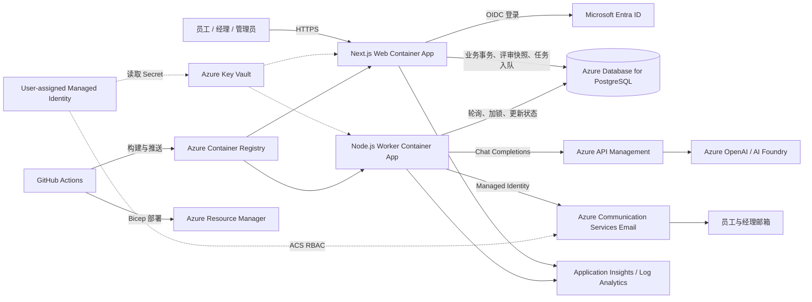

# ReviewPilot

ReviewPilot 是面向企业内部的员工自评与经理审批系统，覆盖模板化自评、量化评分、
AI 总结、版本化审批、团队分析和运营审计。项目采用 TypeScript npm workspaces
monorepo，Web 与异步 Worker 分离部署，业务数据和后台任务统一保存在 PostgreSQL。

## 核心功能

### 员工自评

- 按管理员发布的版本化模板生成评审，支持维度评分、能力评分、行为确认、开放问题和准备项。
- 草稿保存、必填项校验和乐观并发控制，避免多个页面覆盖较新的修改。
- 提交时在事务内计算加权得分、冻结评审快照并创建 AI 后台任务。
- 被驳回后自动生成新的修订草稿，保留上一版本和历史审批记录。

### 经理审批与分析

- 查看团队评审列表、员工原始回答、量化得分和结构化 AI 总结。
- 只有评审指定的审批经理可以通过或驳回，审批评论和状态变更写入审计记录。
- 团队看板展示参与人数、提交/待审批/通过数量、分数分布、能力均值和周期趋势。
- 支持按周期、员工、状态和审批经理筛选数据。

### 管理与运营

- 管理用户状态、角色和员工与经理的审批关系。
- 创建、校验和发布评审模板，创建并开放评审周期。
- 查看后台任务状态、稳定错误码和重试次数，人工重放进入 `DEAD` 的任务。
- 查询关键管理操作的审计事件。
- 通过 Azure Communication Services Email 发送待审批、通过和驳回提醒。

## 评审工作流

```text
DRAFT / REVISION_DRAFT
│ 提交并计算得分
▼
AI_PROCESSING
│ APIM AI 总结完成
▼
PENDING_REVIEW
├── APPROVED
└── REJECTED ──> 新建 REVISION_DRAFT
```

状态迁移由领域层统一校验。AI 调用和邮件通知由数据库后台任务驱动，不阻塞 Web 请求。

## 系统架构



### 关键数据路径

1. Web 在同一 PostgreSQL 事务中保存评审状态、得分快照和后台任务。
2. Worker 使用数据库行锁领取任务，调用 APIM 生成符合 Zod Schema 的结构化总结。
3. AI 总结落库后，Worker 创建并发送 ACS Email 提醒，成功后再标记 Notification 为 `SENT`。
4. 可重试错误按 1、5、15、60 分钟退避；永久错误或耗尽次数的任务进入 `DEAD` 等待管理员处理。

## 工程特性

| 领域 | 实现 |
| --- | --- |
| 模块边界 | Web、Worker、领域规则、持久化和配置拆分为独立 workspace |
| 数据一致性 | Prisma 事务、评审快照、数据库任务队列和通知幂等键 |
| 并发安全 | `lockVersion` 乐观并发控制，Worker 使用原子任务领取 |
| 类型与校验 | TypeScript 严格类型、Zod API/模板/AI Schema、Prisma 数据模型 |
| 权限模型 | Entra ID 登录、应用内 RBAC、资源级审批权限和管理员权限检查 |
| 云端身份 | Container Apps 使用 User-assigned Managed Identity 访问 Key Vault 与 ACS |
| 故障处理 | 可重试/永久错误分类、指数式退避、`DEAD` 任务人工重试 |
| 可观测性 | Azure Monitor、健康检查、审计事件和稳定错误码 |
| 质量门禁 | ESLint、TypeScript、Vitest、Playwright、生产构建、Bicep 和 actionlint |
| 发布策略 | GitHub OIDC、环境级 Variables/Secrets、Bicep、容器镜像和手动生产部署 |

## 技术栈

| 层级 | 技术 |
| --- | --- |
| Web | Next.js 16 App Router、React、Auth.js、Recharts |
| Worker | Node.js 22、esbuild、Azure Identity、ACS Email SDK |
| 数据 | PostgreSQL 16、Prisma ORM |
| AI | Azure API Management、Azure OpenAI Chat Completions |
| 校验与测试 | Zod、Vitest、Playwright、ESLint、TypeScript |
| Azure | Container Apps、ACR、Key Vault、Managed Identity、Azure Monitor |
| IaC / CI/CD | Bicep、GitHub Actions、GitHub OIDC |

## 本地开发

要求 Node.js 22、npm 和 PostgreSQL 16。

```bash
npm ci
cp apps/web/.env.example apps/web/.env.local
cp apps/worker/.env.example apps/worker/.env
npm run generate -w @employee-review/db
npx prisma migrate deploy \
--schema packages/db/prisma/schema.prisma
npm run seed -w @employee-review/db
npm run dev
```

Web 默认地址为 <http://localhost:3000>，健康检查为 `/api/health`。Worker 可在构建后单独启动：

```bash
npm run build -w @employee-review/worker
npm start -w @employee-review/worker
```

本地配置模板位于 `apps/web/.env.example` 和 `apps/worker/.env.example`。
真实 Secret 只保存在本地 `.env`、GitHub Environment Secrets 或 Azure Key Vault，
不应提交到仓库。

## 验证

```bash
npm run lint
npm run typecheck
npm test
npm run e2e
npm run build
az bicep build --file infra/main.bicep
```

## 项目结构

- `apps/web`：角色保护页面、JSON API、Entra ID 登录。
- `apps/worker`：AI、ACS Email 提醒和任务重试。
- `packages/domain`：模板、评分、状态机和 AI Schema。
- `packages/db`：Prisma schema、迁移、seed 和 repositories。
- `packages/config`：运行时配置校验和日志脱敏。
- `e2e`：Playwright 端到端测试。
- `infra`：Azure Container Apps、PostgreSQL、ACR、Key Vault、Managed Identity 与监控。
- `docs/operations`：环境配置、Azure 权限、发布、恢复和回滚手册。

## 部署

生产发布只能手动触发 `.github/workflows/deploy.yml`。Workflow 依次执行质量检查、
构建并推送 Web/Worker 镜像、Bicep what-if、基础设施部署、数据库迁移和健康检查。

正式配置填写在 GitHub `dev`/`prod` Environment，不写入仓库，也不需要手工创建
Key Vault secret。部署前需要准备 Entra App Registration、APIM 接口和已验证的
ACS Email 资源。

完整环境变量、Azure 权限、DNS、故障处理和回滚步骤见
[运行手册](docs/operations/runbook.md)。详细需求与设计背景见
[系统设计](2026-07-30-employee-review-system-design.md)。
